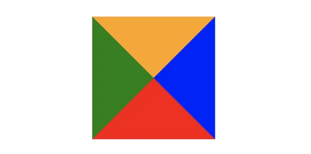
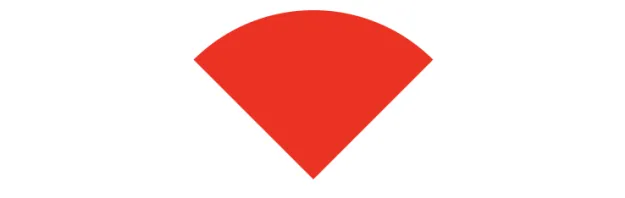

# css 经典面试题

## 1.CSS 选择器以其优先级

### 选择器

- 基础选择器: id 选择器 ，class 类选择器，标签选择器
- 复合选择器: 后代选择器，子代选择器，并集选择器,交集选择器
- 伪类选择器: :active 选择活动链接
- 伪元素选择器: :last-child 表示一组兄弟元素中的最后一个元素

### 选择器优先级

- 标签选择器、伪元素选择器：1
- 类选择器、伪类选择器、属性选择器：10
- id 选择器：100
- 内联样式：1000

### !注意事项

- !important 声明的样式的优先级最高
- 如果优先级相同，则最后出现的样式生效
- 继承得到的样式的优先级最低
- 通用选择器（\*）、子选择器（>）和相邻同胞选择器（+）并不在这四个等级中，所以它们的权值都为 0
- 样式表的来源不同时，优先级顺序为：内联样式 > 内部样式 > 外部样式 > 浏览器用户自定义样式 > 浏览器默认样式。

## 2.CSS 中能被继承的属性

- 字体系列属性

  ```css
  font-family：字体系列
  font-weight：字体的粗细
  font-size：字体的大小
  font-style：字体的风格
  ```

- 文本系列属性

  ```css
  text-indent：文本缩进
  text-align：文本水平对齐
  line-height：行高
  text-transform：控制文本大小写
  color：文本颜色(uppercase、lowercase、capitalize)
  ```

- 元素可见性

  ```css
  visibility：控制元素显示隐藏
  ```

- 表格布局属性

  ```css
  caption-side：定位表格标题位置
  border-collapse：合并表格边框
  border-spacing：设置相邻单元格的边框间的距离
  empty-cells：单元格的边框的出现与消失
  table-layout：表格的宽度由什么决定
  ```

- 列表布局属性

  ```css
  list-style：列表风格，包括list-style-type、list-style-image等
  ```

- 光标属性

  ```css
  cursor：光标显示为何种形态
  ```

## 3.隐藏元素的方法

- display: none **元素不可见，不占据页面空间，无法响应点击事件**
- visibility:hidden **元素不可见，占据页面空间，无法响应点击事件**
- opacity:0 透明度设置为 0 **元素不可见，占据页面空间，可以响应点击事件**
- 设置 height、width 属性为 0 **元素不可见，不占据页面空间，无法响应点击事件**
- position:absolute 将元素定位到可视区外部 **元素不可见，不影响页面布局**
- transform: scale（0,0）通过缩放隐藏 **元素不可见，占据页面空间，不影响页面布局**

## 4.link 和 import 的区别

### 从属关系区别

- @import 是 CSS 提供的语法规则，只有导入样式表的作用
- link 是 HTML 提供的标签，不仅可以加载 CSS 文件，还可以定义 RSS、rel 连接属性等

### 加载顺序区别

- 加载页面时，link 标签引入的 CSS 被同时加载
- @import 引入的 CSS 将在页面加载完毕后被加载

### 兼容性区别

- @import 是 CSS2.1 才有的语法，故只可在 IE5+才能识别
- link 标签作为 HTML 元素，不存在兼容性问题

### DOM 可控性区别

- link 支持使用 Javascript 控制 DOM 去改变样式
- @import 不支持

## 5.transition 和 animation 的区别

- **transition 是过渡属性**，强调过度，它的实现需要触发一个事件（比如鼠标移动上去，焦点，点击等）才执行动画。
- **animation 是动画属性**，它的实现不需要触发事件，设定好时间之后可以自己执行，且可以循环一个动画。可用@keyframe 设置多个关键帧

## 6.display:none 与 visibility:hidden 的区别

### 是否占据空间

- display: none 隐藏时不占原先的页面空间，不影响页面布局

- visiblilty:hidden 隐藏时占据原先的页面空间，影响页面布局

### 是否有继承性

- display: none 不具有继承属性，元素及其子元素都将隐藏不可见

- visiblilty:hidden 具有继承性，元素的子元素却可以设置 visibility: visible 显示出来

### 是否会触发页面重绘和回流

- display: none 会触发 reflow（回流），进行渲染。

- visiblilty:hidden 只会触发 repaint（重绘），不进行渲染。

## 7.怎么理解回流和重绘

### 浏览器解析渲染机制

- 解析 HTML，生成 DOM 树，解析 CSS，生成 CSSOM 树
- 将 DOM 树和 CSSOM 树结合，生成渲染树(Render Tree)
- Layout(回流):根据生成的渲染树，进行回流(Layout)，得到节点的几何信息（位置，大小）
- Painting(重绘):根据渲染树以及回流得到的几何信息，得到节点的绝对像素
- Display:将像素发送给 GPU，展示在页面上

### 回流

当我们对 DOM 的修改引发了 DOM **几何尺寸的变化**（比如修改元素的宽、高或隐藏元素等）时，浏览器需要重新计算元素的*几何属性*（其他元素的几何属性和位置也会因此受到影响），然后再将计算的结果绘制出来。这个过程就是回流（也叫重排）。【重新排列布局，即打碎重组】

**触发机制**

- 添加或删除可见的 DOM 元素
- 元素的位置发生变化
- 元素的尺寸发生变化（包括外边距、内边框、边框大小、高度和宽度等）
- 内容发生变化，比如文本变化或图片被另一个不同尺寸的图片所替代
- 浏览器的窗口尺寸变化（因为回流是根据视口的大小来计算元素的位置和大小的）

### 重绘

当我们对 DOM 的修改导致了样式的变化、却并未影响其几何属性（比如修改了颜色或背景色）时，浏览器不需重新计算元素的几何属性、直接为该元素绘制新的样式。这个过程叫做重绘。

**触发机制**

- 颜色的修改
- 文本方向的修改
- 阴影的修改

### 如何减少触发

- 如果想设定元素的样式，通过改变元素的 `class` 类名 (尽可能在 DOM 树的最里层)
- 避免设置多项内联样式
- 应用元素的动画，使用 `position` 属性的 `fixed` 值或 `absolute` 值
- 避免使用 `table` 布局，`table` 中每个元素的大小以及内容的改动，都会导致整个 `table` 的重新计算
- 对于那些复杂的动画，对其设置 `position: fixed/absolute`，尽可能地使元素脱离文档流，从而减少对其他元素的影响
- 使用 css3 硬件加速，可以让`transform`、`opacity`、`filters`这些动画不会引起回流重绘
- 避免使用 CSS 的 `JavaScript` 表达式

## 8.盒子模型

**标准盒子模型**

- 盒子总宽度 = width + padding + border + margin
- 盒子总高度 = height + padding + border + margin

也就是，`width/height` 只是内容高度，不包含 `padding` 和 `border`值

**IE 怪异盒模型**

- 盒子总宽度 = width + margin
- 盒子总高度 = height + margin

也就是，`width/height` 包含了 `padding`和 `border`值

## 9.什么是 BFC

```
块格式化上下文（Block Formatting Context，BFC）是Web页面的可视化CSS渲染的一部分，是布局过程中生成块级盒子的区域，也是浮动元素与其他元素的交互限定区域。

通俗来讲：BFC是一个独立的布局环境，可以理解为一个容器，在这个容器中按照一定规则进行物品摆放，并且不会影响其它环境中的物品。如果一个元素符合触发BFC的条件，则BFC中的元素布局不受外部影响。

BFC最大的一个作用就是：在页面上有一个独立隔离容器，容器内的元素和容器外的元素布局不会相互影响

BFC的作用:
  解决上外边距重叠:重叠的两个box都开启bfc
  解决浮动引起高度塌陷:容器盒子开启bfc
  解决文字环绕图片:左边图片div,右边文字容器p,将p容器开启bfc

触发BFC的条件是要具备以下为属性：
  1.根元素：body
  2.元素设置浮动：float 除 none 以外的值；
  3.元素设置绝对定位：position (absolute、fixed)；
  4.display 值为：inline-block、table-cell、table-caption、flex等；
  5.overflow 值为：hidden、auto、scroll；

```

## 10.CSS3 有哪些新特性

+ 新增各种 CSS 选择器 （:not(.input)：所有 class 不是“input”的节点）
+ 圆角 （border-radius:8px）
+ 多列布局 （multi-columnlayout）
+ 阴影和反射 （Shadow\Reflect）
+ 文字特效 （text-shadow）
+ 文字渲染 （Text-decoration）
+ 线性渐变 （gradient）
+ 旋转 （transform）
+ 缩放，定位，倾斜，动画，多背景
+ 例如：transform:\scale(0.85,0.90)\translate(0px,-30px)\skew(-9deg,0deg)\Animation

## 11.width:auto 和 width:100%的区别

width:100%会使元素 box 的宽度等于父元素的 contentbox 的宽度。

width:auto 会使元素撑满整个父元素，margin、border、padding、content 区域会自动分配水平空间。

## 12. ::before 和 :after 的双冒号和单冒号有什么区别？

- 冒号(`:`)用于`CSS3`伪类，双冒号(`::`)用于`CSS3`伪元素。
- `::before`就是以一个子元素的存在，定义在元素主体内容之前的一个伪元素。并不存在于`dom`之中，只存在在页面之中。

## 13.文本溢出隐藏样式

- 单行文本溢出隐藏

```css
overflow: hidden; // 溢出隐藏
text-overflow: ellipsis; // 溢出用省略号显示
white-space: nowrap; // 规定段落中的文本不进行换行
```

- 多行文本溢出隐藏

```css
overflow: hidden; // 溢出隐藏
text-overflow: ellipsis; // 溢出用省略号显示
display: -webkit-box; // 作为弹性伸缩盒子模型显示。
-webkit-box-orient: vertical; // 设置伸缩盒子的子元素排列方式：从上到下垂直排列
-webkit-line-clamp: 3; // 显示的行数
```

## 14.清除浮动

+  clear:both
+  overflow:hidden
+  after 伪元素清除浮动
+  before 和 after 双伪元素清除浮动
+  父级 div 定义 height

## 15.em/rem/px/vh/vw 区别

### px

px，表示像素，所谓像素就是呈现在我们显示器上的一个个小点，每个像素点都是大小等同的，所以像素为计量单位被分在了绝对长度单位中

### em

em 是相对长度单位。相对于当前对象内文本的字体尺寸。如当前对行内文本的字体尺寸未被人为设置，则相对于浏览器的默认字体尺寸`1em = 16px`

为了简化 `font-size` 的换算，我们需要在`css`中的 `body` 选择器中声明`font-size`= `62.5%`，这就使 em 值变为 `16px*62.5% = 10px`

这样 `12px = 1.2em`, `10px = 1em`, 也就是说只需要将你的原来的`px` 数值除以 10，然后换上 `em`作为单位就行了

### rem

rem，相对单位，相对的只是 HTML 根元素`font-size`的值

利用 rem 可以实现简单的响应式布局，可以利用 html 元素中字体的大小与屏幕间的比值来设置 font-size 的值，以此实现当屏幕分辨率变化时让元素也随之变化。

### vh/vw

vw/vh 是与视图窗口有关的单位，vw 表示相对于视图窗口的宽度，vh 表示相对于视图窗口高度

vh：相对于视窗的高度，视窗高度是 100vh

vw：相对于视窗的宽度，视窗宽度是 100vw

## 16.实现两栏布局

**两栏布局:左边宽度固定，右边自适应**

### 利用浮动

```html
<style>
  .box{
      overflow: hidden; 添加BFC
  }
  .left {
      float: left;
      width: 200px;
      background-color: gray;
      height: 400px;
  }
  .right {
      margin-left: 210px;
      background-color: lightgray;
      height: 200px;
  }
</style>
<div class="box">
  <div class="left">左边</div>
  <div class="right">右边</div>
</div>
```

### flex 弹性布局

```html
<style>
  .box {
    display: flex;
  }
  .left {
    width: 100px;
  }
  .right {
    flex: 1;
  }
</style>
<div class="box">
  <div class="left">左边</div>
  <div class="right">右边</div>
</div>
```

注意的是，`flex`容器的一个默认属性值:`align-items: stretch;`

这个属性导致了列等高的效果。 为了让两个盒子高度自动，需要设置: `align-items: flex-start`

## 17.实现三栏布局

**三栏布局:左右两栏宽高固定，中间自适应**

### 两边使用 float，中间使用 margin

```html
<style>
  .wrap {
      background: #eee;
      overflow: hidden; <!-- 生成BFC，计算高度时考虑浮动的元素 -->
      padding: 20px;
      height: 200px;
  }
  .left {
      width: 200px;
      height: 200px;
      float: left;
      background: coral;
  }
  .right {
      width: 120px;
      height: 200px;
      float: right;
      background: lightblue;
  }
  .middle {
      margin-left: 220px;
      height: 200px;
      background: lightpink;
      margin-right: 140px;
  }
</style>
<div class="wrap">
  <div class="left">左侧</div>
  <div class="right">右侧</div>
  <div class="middle">中间</div>
</div>
```

原理:

- 两边固定宽度，中间宽度自适应
- 利用中间元素的 margin 值控制两边的间距
- 宽度小于左右部分宽度之和时，右侧部分会被挤下去

存在的缺陷

- 主体内容是最后加载的
- 右边在主体内容之前，如果是响应式设计，不能简单的换行展示

### 两边使用 absolute，中间使用 margin

```html
<style>
  .container {
    position: relative;
  }

  .left,
  .right,
  .main {
    height: 200px;
    line-height: 200px;
    text-align: center;
  }

  .left {
    position: absolute;
    top: 0;
    left: 0;
    width: 100px;
    background: green;
  }

  .right {
    position: absolute;
    top: 0;
    right: 0;
    width: 100px;
    background: green;
  }

  .main {
    margin: 0 110px;
    background: black;
    color: white;
  }
</style>

<div class="container">
  <div class="left">左边固定宽度</div>
  <div class="right">右边固定宽度</div>
  <div class="main">中间自适应</div>
</div>
```

实现流程:

- 左右两边使用绝对定位，固定在两侧
- 中间占满一行，但通过 margin 和左右两边留出 10px 的间隔

### 两边使用 float 和负 margin

```html
<style>
  .left,
  .right,
  .main {
    height: 200px;
    line-height: 200px;
    text-align: center;
  }

  .main-wrapper {
    float: left;
    width: 100%;
  }

  .main {
    margin: 0 110px;
    background: black;
    color: white;
  }

  .left,
  .right {
    float: left;
    width: 100px;
    margin-left: -100%;
    background: green;
  }

  .right {
    margin-left: -100px; /* 同自身宽度 */
  }
</style>

<div class="main-wrapper">
  <div class="main">中间自适应</div>
</div>
<div class="left">左边固定宽度</div>
<div class="right">右边固定宽度</div>
```

实现过程:

- 中间使用了双层标签，外层是浮动的，以便左中右能在同一行展示
- 左边通过使用负 margin-left:-100%，相当于中间的宽度，所以向上偏移到左侧
- 右边通过使用负 margin-left:-100px，相当于自身宽度，所以向上偏移到最右侧

缺点:

- 增加了 .main-wrapper 一层，结构变复杂
- 使用负 margin，调试也相对麻烦

### display: table 实现

```html
<style>
  .container {
    height: 200px;
    line-height: 200px;
    text-align: center;
    display: table;
    table-layout: fixed;
    width: 100%;
  }

  .left,
  .right,
  .main {
    display: table-cell;
  }

  .left,
  .right {
    width: 100px;
    background: green;
  }

  .main {
    background: black;
    color: white;
    width: 100%;
  }
</style>

<div class="container">
  <div class="left">左边固定宽度</div>
  <div class="main">中间自适应</div>
  <div class="right">右边固定宽度</div>
</div>
```

实现原理:

- 层通过 display: table 设置为表格，设置 table-layout: fixed`表示列宽自身宽度决定，而不是自动计算
- 内层的左中右通过 display: table-cell 设置为表格单元
- 左右设置固定宽度，中间设置 width: 100% 填充剩下的宽度

### flex 实现

```html
<style type="text/css">
  .wrap {
    display: flex;
    justify-content: space-between;
  }

  .left,
  .right,
  .middle {
    height: 100px;
  }

  .left {
    width: 200px;
    background: coral;
  }

  .right {
    width: 120px;
    background: lightblue;
  }

  .middle {
    background: #555;
    width: 100%;
    margin: 0 20px;
  }
</style>
<div class="wrap">
  <div class="left">左侧</div>
  <div class="middle">中间</div>
  <div class="right">右侧</div>
</div>
```

实现过程：

- 仅需将容器设置为`display:flex;`
- 盒内元素两端对其，将中间元素设置为`100%`宽度，或者设为`flex:1`，即可填充空白
- 盒内元素的高度撑开容器的高度

优点：

- 结构简单直观
- 可以结合 flex 的其他功能实现更多效果，例如使用 order 属性调整显示顺序，让主体内容优先加载，但展示在中间

### grid 网格布局

```html
<style>
  .wrap {
    display: grid;
    width: 100%;
    grid-template-columns: 300px auto 300px;
  }

  .left,
  .right,
  .middle {
    height: 100px;
  }

  .left {
    background: coral;
  }

  .right {
    background: lightblue;
  }

  .middle {
    background: #555;
  }
</style>
<div class="wrap">
  <div class="left">左侧</div>
  <div class="middle">中间</div>
  <div class="right">右侧</div>
</div>
```

## 18.实现⽔平垂直居中的方案

### 利用定位+margin:auto

```html
<style>
  .father {
    width: 500px;
    height: 300px;
    border: 1px solid #0a3b98;
    position: relative;
  }
  .son {
    width: 100px;
    height: 40px;
    background: #f0a238;
    position: absolute;
    top: 0;
    left: 0;
    right: 0;
    bottom: 0;
    margin: auto;
  }
</style>
<div class="father">
  <div class="son"></div>
</div>
```

### 利用定位+margin:负值

```html
<style>
  .father {
    position: relative;
    width: 200px;
    height: 200px;
    background: skyblue;
  }
  .son {
    position: absolute;
    top: 50%;
    left: 50%;
    margin-top: -50px; /* 自身 height 的一半 */
    margin-left: -50px; /* 自身 width 的一半 */
    width: 100px;
    height: 100px;
    background: red;
  }
</style>
<div class="father">
  <div class="son"></div>
</div>
```

### 利用定位+transform

```html
<style>
  .father {
    position: relative;
    width: 200px;
    height: 200px;
    background: skyblue;
  }
  .son {
    position: absolute;
    top: 50%;
    left: 50%;
    transform: translate(-50%, -50%);
    width: 100px;
    height: 100px;
    background: red;
  }
</style>
<div class="father">
  <div class="son"></div>
</div>
```

### flex 弹性布局

利用`justify-content: center`和`align-items: center`,可以非常简单实现

```html
<style>
  .father {
    display: flex;
    justify-content: center;
    align-items: center;
    width: 200px;
    height: 200px;
    background: skyblue;
  }
  .son {
    width: 100px;
    height: 100px;
    background: red;
  }
</style>
<div class="father">
  <div class="son"></div>
</div>
```

### table 布局

设置父元素为`display:table-cell`，子元素设置 `display: inline-block`。利用`vertical`和`text-align`可以让所有的行内块级元素水平垂直居中

```html
<style>
  .father {
    display: table-cell;
    width: 200px;
    height: 200px;
    background: skyblue;
    vertical-align: middle;
    text-align: center;
  }
  .son {
    display: inline-block;
    width: 100px;
    height: 100px;
    background: red;
  }
</style>
<div class="father">
  <div class="son"></div>
</div>
```

## 19. flex:1 表示什么

flex:1 是一个常用的 flex 属性值，它表示弹性盒子的子元素将平均分配剩余空间

## 20.响应式设计的概念及基本原理

响应式网站设计`（Responsive Web design`）是一个网站能够兼容多个终端，而不是为每一个终端做一个特定的版本。

关于原理： 基本原理是通过媒体查询`（@media）`查询检测不同的设备屏幕尺寸做处理。

关于兼容： 页面头部必须有meta声明的`viewport`。

````html
<meta name="’viewport’" content="”width=device-width," initial-scale="1." maximum-scale="1,user-scalable=no”"/>
````

## 21.实现一个三角形
css 绘制三角形主要是利用 `border` 属性

+ 首先实现下图效果



````css
div {
    width: 0;
    height: 0;
    border: 100px solid;
    border-color: orange blue red green;
}
````

+ 三角


````css
div {
    width: 0;
    height: 0;
    border-bottom: 50px solid red;
    border-right: 50px solid transparent;
    border-left: 50px solid transparent;
}
````

+ 三角2


````css
div {
    width: 0;
    height: 0;
    border-top: 100px solid red;
    border-right: 100px solid transparent;
}
````

总体的原则就是通过上下左右边框来控制三角形的方向，用边框的宽度比来控制三角形的角度。

## 22.实现一个扇形



````css
div{
    border: 100px solid transparent;
    width: 0;
    height: 0;
    border-radius: 100px;
    border-top-color: red;
}
````

## 23.画一条0.5px的线

+ **采用`transform: scale()`的方式**，该方法用来定义元素的2D 缩放转换：

```css
transform: scale(0.5,0.5);
```

+ **采用meta viewport的方式**

````css
<meta name="viewport" content="width=device-width, initial-scale=0.5, minimum-scale=0.5, maximum-scale=0.5"/>
````

这样就能缩放到原来的0.5倍，如果是1px那么就会变成0.5px。viewport只针对于移动端，只在移动端上才能看到效果

## 24.设置小于12px的字体

在谷歌下css设置字体大小为12px及以下时，显示都是一样大小，都是默认12px

解决办法：

+ 使用Webkit的内核的-webkit-text-size-adjust的私有CSS属性来解决，只要加了-webkit-text-size-adjust:none;字体大小就不受限制了。但是chrome更新到27版本之后就不可以用了。所以高版本chrome谷歌浏览器已经不再支持-webkit-text-size-adjust样式，所以要使用时候慎用
+ 使用css3的transform缩放属性-webkit-transform:scale(0.5); 注意-webkit-transform:scale(0.75);收缩的是整个元素的大小，这时候，如果是内联元素，必须要将内联元素转换成块元素，可以使用display：block/inline-block/...

